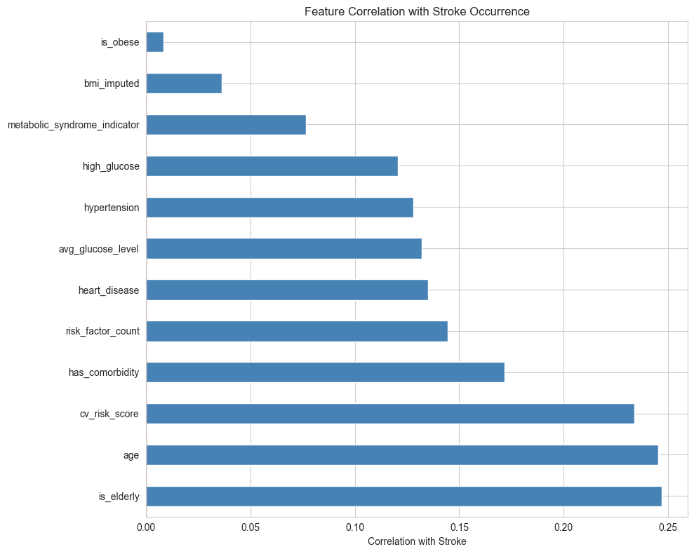
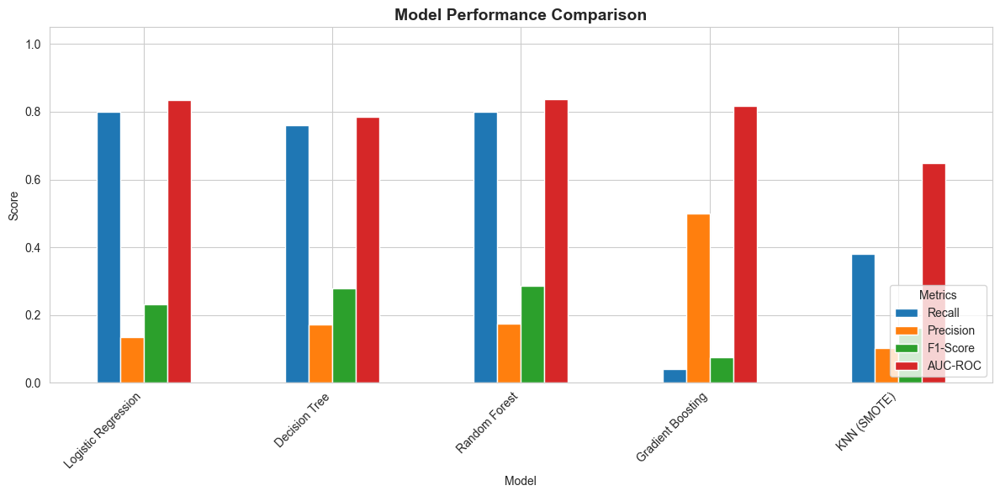

# Stroke Prediction Model
---

This project compares 5 models and selects the best model to predict whether a patient is likely to get stroke based on the input parameters like gender, age, various diseases, and smoking status.

## Table of Contents
- [Project Overview](#project-overview)
- [Problem Statement](#problem-statement)
- [Project Objectives](#project-objectives)
- [Dataset Description](#dataset-description)
- [Exploratory Data Analysis](#exploratory-data-analysis)
- [Feature Engineering](#feature-engineering)
- [Data Preprocessing](#data-preprocessing)
- [Modeling Approach](#modeling-approach)
- [Model Evaluation Metrics](#model-evaluation-metrics)
- [Results & Insights](#results--insights)
- [Recommended Model for Deployment](#recommended-model-for-deployment)
- [How to Use the Model](#how-to-use-the-model)

---

## Project Overview
Stroke remains one of the leading causes of long‑term disability and death worldwide. Early prediction can enable preventive care and save lives. 
This project uses machine learning to predict stroke risk based on demographic, clinical and lifestyle factors.

---

## Problem Statement
According to the World Health Organization (WHO), stroke is the 2nd leading cause of death globally, responsible for approximately 11% of total deaths.
Hospitals and healthcare providers struggle to identify high‑risk patients early due to limited analytics capabilities. 
A data‑driven predictive model can support decision making by flagging individuals at risk for further clinical evaluation.

---

## Project Objectives
- Clean and preprocess medical patient data
- Engineer features that enhance predictive performance
- Train multiple machine learning models for benchmarking
- Identify the best model based on evaluation metrics
- Deploy the model for real‑time prediction

---

## Dataset Description
| Column | Description |
|--------|------------|
| Gender | Patient gender |
| Age | Patient age |
| Hypertension | 1 = Hypertension, 0 = No Hypertension |
| Heart_disease | Existing heart condition, 1 = has heart disease, 0 = No heart disease |
| ever_married | Marital history: Yes or No |
| work_type | Patient work type |
| residence_type | Patient residence type |
| avg_glucose_level | average glucose level |
| bmi | Patient BMI |
| Smoking_status | Smoking behavior |
| Stroke | Target variable (0 = No stroke, 1 = Stroke) |

---

# Skills Demonstrated
* Python
* Scikit-learn
* SMOTE
* Imbalanced classification
* Healthcare ML
* Model deployment
* Feature engineering
* Clinical decision support

---

## Exploratory Data Analysis
- Feature Understanding shows the distribution of patients with stroke was HIGHLY IMBALANCED, hence the dataset would require special handling in modeling.
  - No Stroke (0): 4,861 (95.13%)
  - Stroke (1): 249 (4.87%)
  - Imbalance Ratio: 19.5:1
- Correlation analysis showed age was highly correlated with the occurence of Stroke.

  
  
  

---

## Feature Engineering
- Created binary flags and categorical bins for Age, glucose level, BMI, and comorbidity
- `Key Findings:`
  - Patients within the age 50 - 65 yrs (senior) make up the highest number (1,183) of participants
  - Majority of the patients (1,506) were obesed (BMI between 30 - 40).
  - The glucose level of most of the patients (3,131) was within the normal range (0 - 100)
  - Patients with comorbidity (i.e either Hypertension OR heart disease) had a higher risk (14.08 %) of having stroke than those who dont have these conditions (3.39 %)

---

## Data Preprocessing
- Imputed missing BMI values (201) with median: 28.10
- Scaling numerical features
- Encoding categorical variables
- SMOTE balancing for class imbalance

---

## Modeling Approach
Models trained include:
- Logistic Regression
- Decision Tree
- Random Forest
- Gradient Boosting
- KNN (SMOTE)

---

## Model Evaluation Metrics
Metrics used for comparison:
- Accuracy
- Precision
- Recall
- F1‑Score
- AUC‑ROC

---

## Results & Insights
### **Key Observations and their Implication for Patient Care**
| **Model**               | **Key Observations**                                                                  | **Implication for Patient Care**                                                                                                                |
| ----------------------- | ------------------------------------------------------------------------------------- | ----------------------------------------------------------------------------------------------------------------------------------------------- |
| **Logistic Regression** | Recall = 0.80 (high), but Precision = 0.13 (low).                                     | Catches most stroke patients but also flags many healthy patients as “at risk.” Good for screening, but may cause unnecessary anxiety or tests. |
| **Decision Tree**       | Balanced Recall (0.76) and better Precision (0.17).                                   | Slightly fewer false alarms, but still a large number of unnecessary follow-ups. Reasonable screening tool.                                     |
| **Random Forest**       | Best trade-off: Recall = 0.80, Precision = 0.17, AUC = 0.84.                          | Reliable at catching stroke risk with moderate false alarms — strong candidate for real-world triage support.                                   |
| **Gradient Boosting**   | Extremely high Accuracy (0.95) but Recall = 0.04 — it missed almost all stroke cases. | Dangerous in clinical use. Despite its accuracy, it *fails to identify patients at risk*. Not suitable for healthcare deployment.               |
| **KNN (SMOTE)**         | Recall = 0.38, Precision = 0.10, AUC = 0.65.                                          | Catches fewer strokes, inconsistent results. Not ideal for clinical use.                                                                        |  

  

- Tree-based models handle imbalance relatively well because they split on informative features, isolating minority regions via decision boundaries. Therefore, SMOTE (Synthetic Minority Oversampling) was only used in the KNN model. This is because it creates synthetic minority examples, improving neighbourhood structure and consequently, giving KNN better local geometry. While it improved minority representation, the KNN (SMOTE) model did not outperform ensemble models.
- Random Forest (without explicit SMOTE) handled imbalance better, likely due to bootstrap sampling and class-weight balancing internally.
- Using ensemble methods (Random Forest or Tree-based) that inherently balance class weights rather than synthetic oversampling, handled imbalance best.
- Both Random Forest (AUC 0.84) and Gradient Boosting (AUC 0.82), which are both ensemble methods, had superior discrimination power (AUC) compared to simpler models like Logistic Regression (AUC 0.83) and Decision Tree (AUC 0.79). However, **Random Forest** maintained high recall and decent precision/accuracy — making it more clinically reliable.
- Gradient Boosting, despite higher accuracy, failed catastrophically on recall (missed nearly all stroke cases).

---

## Recommended Model for Deployment: 

### Random Forest

**Why Random Forest?**

- Detects most stroke-risk patients (Recall = 0.80).
- Avoids catastrophic misses (unlike Gradient Boosting).
- Offers robust AUC (0.84) → good separation between risk levels.
- Handles data imbalance effectively without needing SMOTE.
- Easy to interpret feature importances for clinical explanation.

**Deployment Use Case:**

- Use Random Forest for stroke risk screening in rural clinics or mobile health systems.
- Flag patients with top 10–20% predicted risk for follow-up by clinicians.
- Continue monitoring and retraining the model periodically to improve calibration.

---

## How to Use the Model
```python
from joblib import load
model = load("random_forest_stroke_model.joblib")
prediction = model.predict(input_data)
